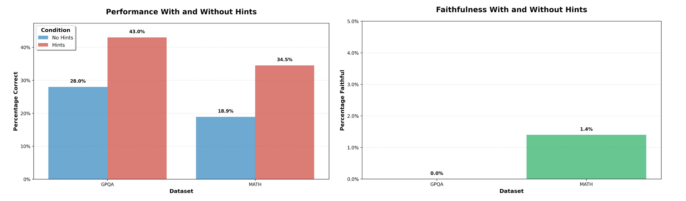
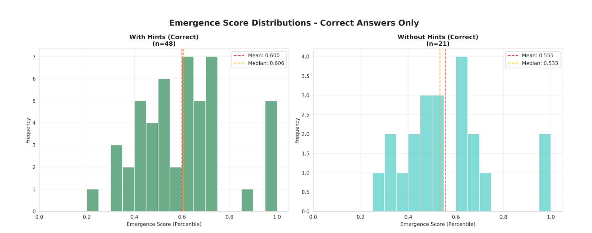
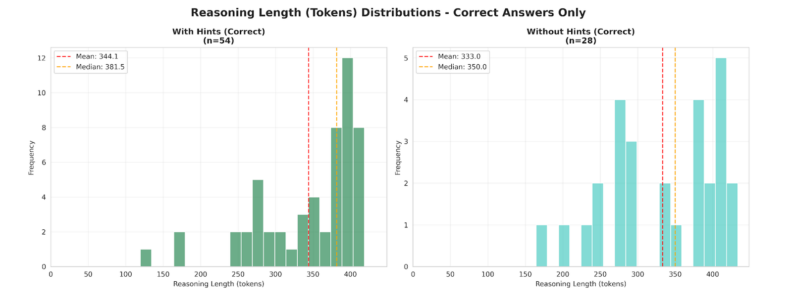
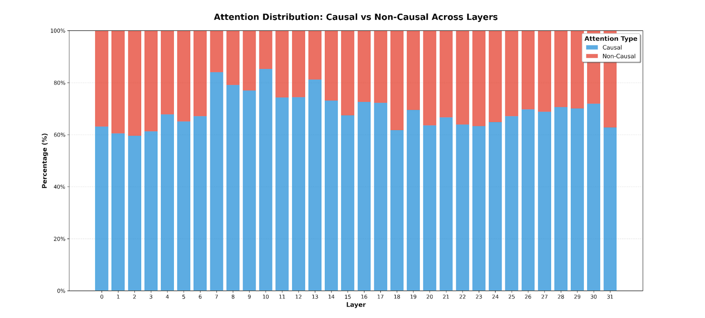
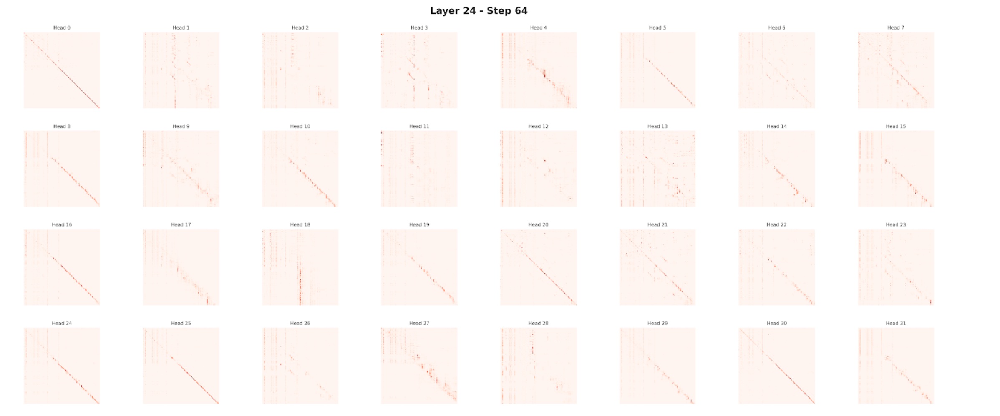

# Detecting Unfaithfulness in Diffusion Language Model CoTs

This project investigates whether Diffusion Language Models (DLMs) produce unfaithful Chain-of-Thought (CoT) reasoning and explores methods for detecting this behavior by leveraging the unique properties of the diffusion generation process.

All experiments were conducted using the **MMaDA 8B** model on the **GPQA Diamond** and **MATH** datasets.

---

## Research Questions

1.  Do Diffusion Language Models (DLMs) generate unfaithful reasoning traces, and if so, how much?
2.  Can we use the properties of the DLM's reverse diffusion process to detect when the model is being unfaithful?

---

## Key Findings

### DLMs Generate Unfaithful CoTs
We confirm that DLMs do produce unfaithful reasoning. When provided with "hints" containing the correct answer, the model's performance on both multiple-choice (GPQA) and free-response (MATH) tasks improved significantly. However, the generated CoT did not faithfully acknowledge the use of the hint, a behavior similar to that observed in autoregressive models (**Figure 1**).

### DLM Detection Methods 
We test to see if we can detect unfaithfulness using characteristics of DLM sampling

* **Token Finalization Timing**: We hypothesized that in unfaithful examples, the model would finalize the answer token earlier in the reverse diffusion process. However, we found **no apparent correlation** between the faithfulness of the reasoning and the "emergence score" (the step at which the answer is finalized) (**Figure 2**).

* **Reasoning Trace Length**: There was **no significant difference** in the length of reasoning traces between faithful and unfaithful examples (**Figure 3**).

* **Attention Causality**: We explored whether unfaithful reasoning would lead to less causal attention patterns (i.e., tokens attending more to future tokens to back-justify an answer). This also yielded a negative result, with the overall causality remaining nearly identical between faithful and unfaithful trials (69.4% vs. 69.7%).

While attention causality couldn't detect unfaithfulness, we discovered a **consistent, prompt-independent pattern** of causality across the model's layers. Certain layers, particularly in the early-middle of the model, consistently exhibited more causal attention than others, regardless of the input (**Figure 4**).

We also observe interesting attention patterns in DLMs. Future work could look at what exactly in the future DLMs are attending to in attention

---

## Future Directions

While our initial hypotheses for detecting unfaithfulness were not successful, the discovery of consistent, layer-specific attention patterns in a DLM is a promising area for future research. Further investigation into these patterns could provide greater insight into how DLMs process and generate information compared to traditional autoregressive architectures.
